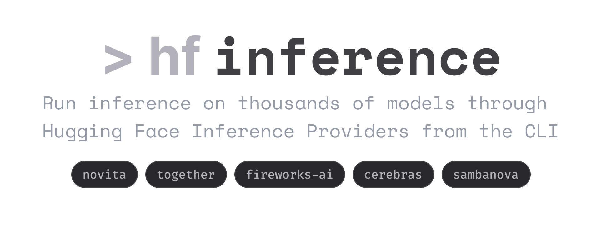

<p align="center">
  
</p>

# hf-inference: `hf` CLI extension for Hugging Face Inference Providers

Run inference on thousands of models through [Hugging Face Inference Providers](https://huggingface.co/docs/inference-providers/en/index) directly from the command line.

## Installation

```bash
curl -LsSf https://hf.co/cli/install.sh | bash
hf extensions install hf-inference
```

## Usage

### Run inference

```bash
hf inference run "What is the capital of France?" --model Qwen/Qwen3.5-35B-A3B
hf inference run "Explain quicksort" --model moonshotai/Kimi-K2.5 --stream
hf inference run "Translate to French: hello world" --model Qwen/Qwen3.5-35B-A3B --provider cheapest
```

Pick a specific provider or routing policy with `--provider`:

```bash
hf inference run "Hello" --model moonshotai/Kimi-K2.5 --provider novita
hf inference run "Hello" --model Qwen/Qwen3.5-35B-A3B --provider cheapest
hf inference run "Hello" --model Qwen/Qwen3.5-35B-A3B --provider fastest
```

Pipe input via stdin:

```bash
cat article.txt | hf inference run --model Qwen/Qwen3.5-35B-A3B --system-prompt "Summarize this"
```

### List available models

```bash
hf inference list
hf inference list --provider novita
hf inference list --search qwen -n 5
hf inference list --format json
hf inference list -q                       # model IDs only
```

### Show provider details for a model

```bash
hf inference info moonshotai/Kimi-K2.5
```

```
PROVIDER      STATUS  CONTEXT  INPUT $/M  OUTPUT $/M  TOOLS  STRUCTURED
------------  ------  -------  ---------  ----------  -----  ----------
fireworks-ai  live    262144                          yes    no        
novita        live    262144   0.6        3           yes    no        
together      live    262144   0.5        2.8         yes    no   
```

## Environment Variables

| Variable | Purpose |
|----------|---------|
| `HF_TOKEN` | Hugging Face API token (also reads from `~/.cache/huggingface/token`) |
